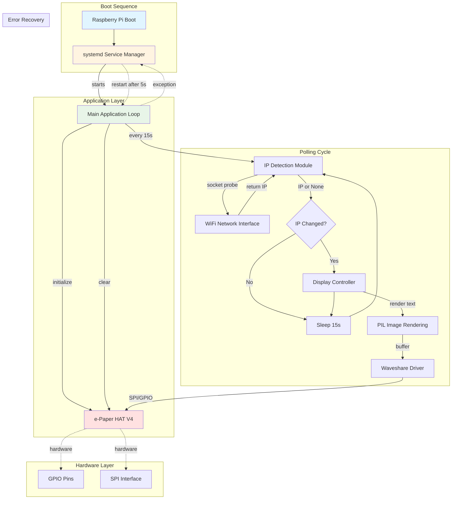
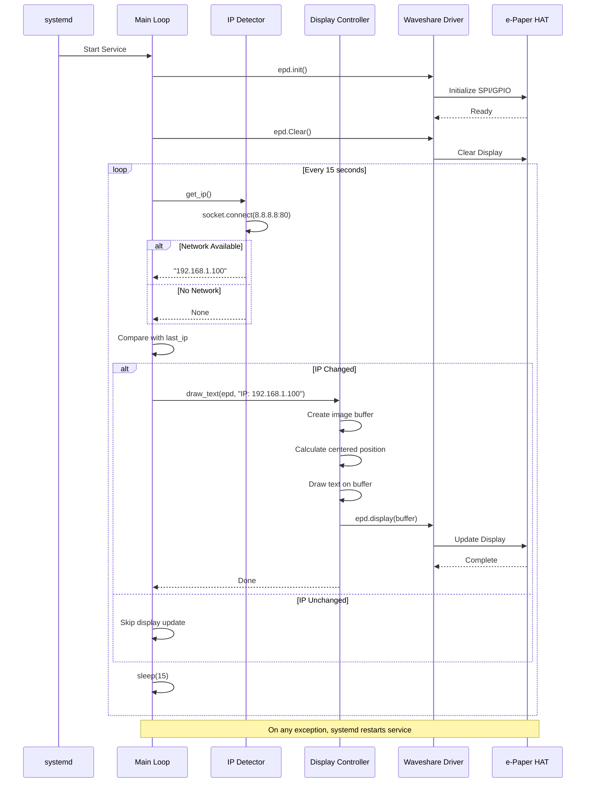
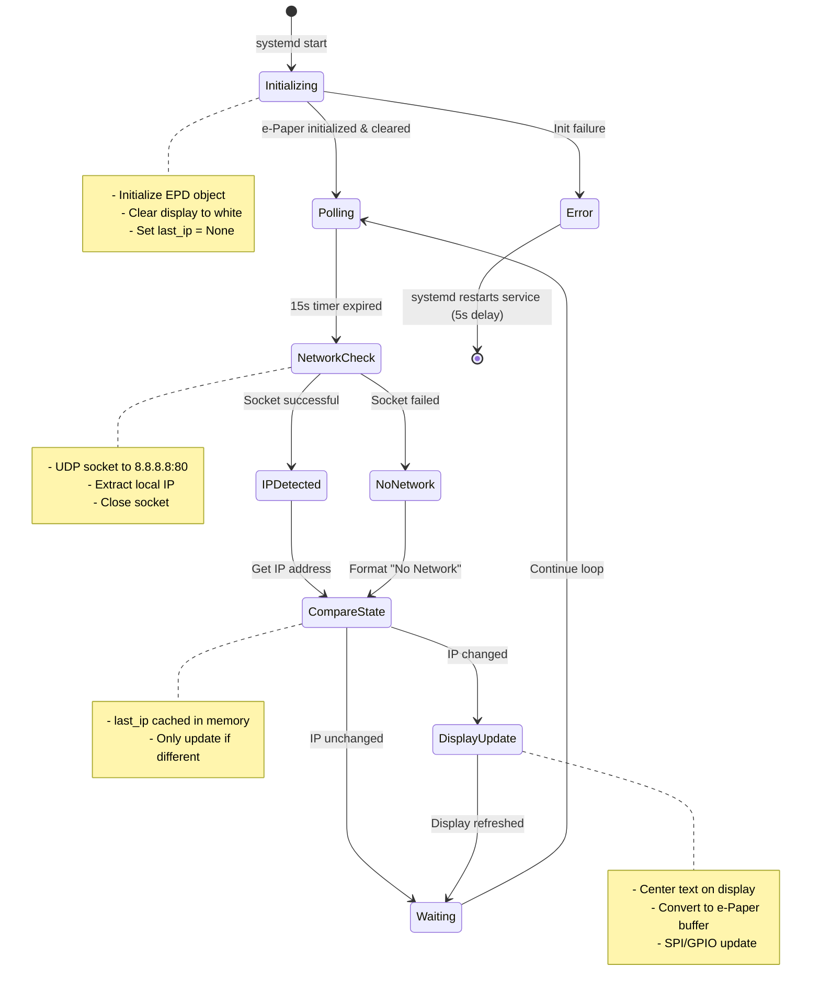
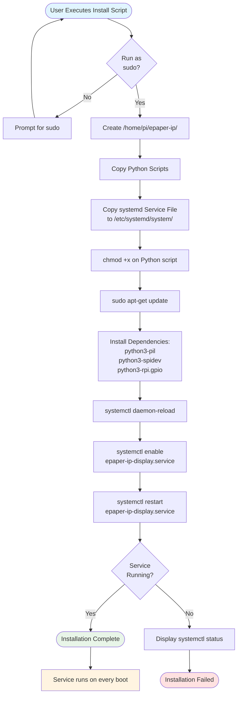

# E-Paper IP Display Master Design

---

## Table of Contents

- [Project Information](<#project information>)
- [Scope](<#scope>)
- [System Overview](<#system overview>)
- [Design Constraints](<#design constraints>)
- [Architecture](<#architecture>)
- [Components](<#components>)
- [Data Design](<#data design>)
- [Interfaces](<#interfaces>)
- [Error Handling](<#error handling>)
- [Non-Functional Requirements](<#non-functional requirements>)
- [Visual Documentation](<#visual documentation>)
- [Version History](<#version history>)

---

## Project Information

```yaml
project_info:
  name: "e-Paper IP Display"
  version: "0.1.0"
  date: "2025-11-21"
  author: "William Watson"
```

[Return to Table of Contents](<#table of contents>)

---

## Scope

```yaml
scope:
  purpose: "Display Raspberry Pi hostname and the IPv4 address of the usb0 and wlan0 interfaces on Waveshare 2.13\" e-Paper HAT V4 with automatic refresh on address change and systemd service integration"
  
  in_scope:
    - "IPv4 address detection for the usb0 and wlan0 interfaces"
    - "E-Paper display rendering with centered text"
    - "Automatic address change detection and display refresh"
    - "Per-interface 'no IP' indication when an interface lacks an IPv4 address"
    - "Detection of pi-netconfig access point mode via wlan0 address match against the known AP IP"
    - "Systemd service for automatic startup on boot"
    - "Automated installation and deployment script"
    - "Service restart on failure"
  
  out_scope:
    - "Configuration files"
    - "IPv6 support"
    - "Dynamic discovery of arbitrary interfaces (interface set fixed to usb0, wlan0)"
    - "Direct integration with pi-netconfig (no shared process, IPC, or imported package; detection is external and heuristic)"
    - "Logging capabilities"
    - "Display customization beyond hostname and interface text"
    - "Web interface or remote control"
    - "Multi-display support"
  
  terminology:
    - term: "e-Paper"
      definition: "Waveshare 2.13 inch e-Paper HAT V4 electronic ink display module"
    - term: "HAT"
      definition: "Hardware Attached on Top - Raspberry Pi expansion board"
    - term: "systemd"
      definition: "Linux system and service manager for service lifecycle control"
    - term: "SPI"
      definition: "Serial Peripheral Interface - hardware communication protocol for e-Paper"
```

[Return to Table of Contents](<#table of contents>)

---

## System Overview

```yaml
system_overview:
  description: "Standalone Python application running as systemd service that continuously monitors the IPv4 address of the usb0 and wlan0 interfaces and displays them, with the hostname, on an e-Paper screen with minimal refresh to prevent ghosting"
  
  context_flow: "Boot → systemd → Python Service → Interface Detection → Display Update → 15s Poll Cycle"
  
  primary_functions:
    - "Detect the IPv4 address of the usb0 and wlan0 interfaces by parsing 'ip -j addr show'"
    - "Initialize and control Waveshare e-Paper V4 HAT"
    - "Render centered text displaying the hostname and per-interface address"
    - "Poll network status every 15 seconds"
    - "Update display only when an interface address changes"
    - "Indicate 'no IP' per interface when unavailable"
    - "Run continuously as background service"
```

[Return to Table of Contents](<#table of contents>)

---

## Design Constraints

```yaml
design_constraints:
  technical:
    - "Raspberry Pi OS (Debian-based Linux)"
    - "Python 3.x runtime environment"
    - "SPI interface must be enabled via raspi-config"
    - "GPIO access required for e-Paper control"
    - "Network interfaces of interest are usb0 and wlan0"
    - "Single process execution model"
    - "E-Paper refresh limitations (ghosting prevention)"
  
  implementation:
    language: "Python 3"
    framework: "None (standard library + hardware libraries)"
    libraries:
      - "json (standard library)"
      - "socket (standard library)"
      - "subprocess (standard library)"
      - "time (standard library)"
      - "PIL (Pillow - Python Imaging Library)"
      - "waveshare_epd.epd2in13_V4 (Waveshare driver)"
    standards:
      - "No logging output"
      - "Minimal refresh strategy (change detection only)"
      - "Hardcoded 'pi' user execution context"
      - "Fixed 15-second polling interval"
  
  performance_targets:
    - metric: "Polling interval"
      value: "15 seconds"
    - metric: "Display refresh"
      value: "Only on IP change"
    - metric: "Network detection timeout"
      value: "Socket connection default timeout"
```

[Return to Table of Contents](<#table of contents>)

---

## Architecture

```yaml
architecture:
  pattern: "Event-driven polling loop with state caching"
  
  component_relationships: "systemd → Main Loop → IP Detector → Display Controller → e-Paper Driver"
  
  technology_stack:
    language: "Python 3"
    framework: "systemd service manager"
    libraries:
      - "PIL (Pillow) for image rendering"
      - "waveshare_epd.epd2in13_V4 for e-Paper control"
      - "socket for network detection"
      - "time for polling interval"
    data_store: "None (stateless except in-memory IP cache)"
  
  directory_structure:
    - "/home/pi/epaper-ip/ - Application directory"
    - "/home/pi/epaper-ip/epaper_ip_display.py - Main application"
    - "/home/pi/epaper-ip/epd2in13_V4.py - Waveshare driver"
    - "/etc/systemd/system/epaper-ip-display.service - Service definition"
```

[Return to Table of Contents](<#table of contents>)

---

## Components

### Main Application Loop

```yaml
- name: "Main Application Loop"
  purpose: "Coordinate continuous IP monitoring and display updates with state change detection"
  
  responsibilities:
    - "Initialize e-Paper display hardware"
    - "Clear display on startup"
    - "Execute infinite polling loop"
    - "Cache previous IP state for change detection"
    - "Trigger display updates only on state change"
    - "Enforce 15-second polling interval"
  
  inputs:
    - field: "None (service start trigger)"
      type: "systemd signal"
      description: "Service start/restart command"
  
  outputs:
    - field: "Display update"
      type: "e-Paper render command"
      description: "Updated IP or status text on screen"
  
  key_elements:
    - name: "main"
      type: "function"
      purpose: "Entry point - initialize display and run polling loop"
  
  dependencies:
    internal:
      - "IP Detection Module"
      - "Display Controller Module"
    external:
      - "waveshare_epd.epd2in13_V4"
      - "time.sleep"
  
  processing_logic:
    - "Initialize e-Paper display object"
    - "Clear display to white"
    - "Retrieve FQDN: try subprocess.check_output(['hostname', '-f'], text=True).strip(); except: socket.gethostname()"
    - "Set last_state cache to None"
    - "Enter infinite while loop:"
    - "  Get usb0 IP via get_interface_ip('usb0'); wlan0 IP via get_interface_ip('wlan0')"
    - "  Format 'usb0: {ip}' or 'usb0: no IP'; 'wlan0: {ip}' or 'wlan0: no IP'"
    - "  Compute ap_active = (wlan_ip == PI_NETCONFIG_AP_IP, constant '192.168.50.1')"
    - "  Compose state tuple (usb_text, wlan_text, ap_active); compare with cached last_state"
    - "  If different, build lines [hostname, usb_text, wlan_text]; append 'AP mode active' if ap_active"
    - "  Call draw_text(epd, lines)"
    - "  Update last_state cache"
    - "  Sleep 15 seconds"
  change_ref: "change-<pending>"
  
  error_conditions:
    - condition: "e-Paper initialization failure"
      handling: "Allow exception to propagate for systemd restart"
    - condition: "Display update failure"
      handling: "Allow exception to propagate for systemd restart"
```

[Return to Table of Contents](<#table of contents>)

### Interface Detection Module

```yaml
- name: "Interface Detection Module"
  purpose: "Detect the IPv4 address of a named interface by parsing 'ip -j addr show'"
  
  responsibilities:
    - "Invoke 'ip -j addr show' and parse the JSON output"
    - "Locate the entry matching the requested interface name"
    - "Return the first inet (IPv4) address, or None"
    - "Return None on subprocess or parse failure"
  
  inputs:
    - field: "interface"
      type: "str"
      description: "Interface name, e.g. 'usb0' or 'wlan0'"
  
  outputs:
    - field: "ip_address"
      type: "str or None"
      description: "IPv4 address string (e.g., '192.168.0.177') or None if the interface is absent or has no IPv4 address"
  
  key_elements:
    - name: "get_interface_ip"
      type: "function"
      purpose: "Return the first IPv4 address of the named interface"
  
  dependencies:
    internal: []
    external:
      - "subprocess.check_output"
      - "json.loads"
  
  processing_logic:
    - "Run subprocess.check_output(['ip', '-j', 'addr', 'show'], text=True)"
    - "Parse output via json.loads()"
    - "Iterate interfaces; select the one whose ifname matches the argument"
    - "Within its addr_info, return the first entry where family == 'inet' (the 'local' field)"
    - "Return None if no match found"
    - "On any exception, return None"
  
  error_conditions:
    - condition: "Interface absent or has no IPv4 address"
      handling: "Return None"
    - condition: "subprocess or JSON parse failure"
      handling: "Return None via exception catch"
```

[Return to Table of Contents](<#table of contents>)

### Display Controller Module

```yaml
- name: "Display Controller Module"
  purpose: "Render a list of text lines on the e-Paper display with centered layout"
  change_ref: "change-<pending>"
  
  responsibilities:
    - "Create blank white image buffer"
    - "Render each line of text centered horizontally"
    - "Stack lines vertically centered as a block"
    - "Send image buffer to e-Paper hardware"
    - "Load TrueType font with fallback chain"
  
  inputs:
    - field: "epd"
      type: "epd2in13_V4.EPD"
      description: "Initialized e-Paper display object"
    - field: "lines"
      type: "list[str]"
      description: "Text lines to render, top to bottom (hostname, usb0, wlan0)"
  
  outputs:
    - field: "None (side effect: display updated)"
      type: "void"
      description: "Lines rendered on physical e-Paper screen"
  
  key_elements:
    - name: "draw_text"
      type: "function"
      purpose: "Render a list of centered lines on e-Paper display"
  
  dependencies:
    internal: []
    external:
      - "PIL.Image"
      - "PIL.ImageDraw"
      - "PIL.ImageFont"
  
  processing_logic:
    - "Create new image: Image.new('1', (epd.height, epd.width), 255) — swapped for rotation"
    - "Create drawing context: ImageDraw.Draw(image)"
    - "Load TrueType font 20pt with fallback chain; fall back to load_default()"
    - "Calculate bounding box for each line via textbbox()"
    - "Compute total block height: sum of line heights + 4px gap between lines"
    - "Calculate vertical start: y_start = (epd.width - total_h) // 2"
    - "Draw each line horizontally centered, advancing y by line height + 4px gap"
    - "Rotate image 90° counter-clockwise"
    - "Display: epd.display(epd.getbuffer(image))"
  
  error_conditions:
    - condition: "Display hardware communication failure"
      handling: "Allow exception to propagate"
```

[Return to Table of Contents](<#table of contents>)

### Installation Framework

```yaml
- name: "Installation Framework"
  purpose: "Automated deployment and systemd service configuration"
  
  responsibilities:
    - "Create application directory structure"
    - "Copy application files to target location"
    - "Install system dependencies via apt"
    - "Configure systemd service"
    - "Enable and start service"
  
  inputs:
    - field: "epaper_ip_display.py"
      type: "file"
      description: "Main application script"
    - field: "epd2in13_V4.py"
      type: "file"
      description: "Waveshare driver file"
    - field: "epaper-ip-display.service"
      type: "file"
      description: "systemd service definition"
  
  outputs:
    - field: "Installed service"
      type: "systemd service"
      description: "Running e-Paper IP display service"
  
  key_elements:
    - name: "epaper-ip-install.sh"
      type: "function"
      purpose: "Shell script for automated installation"
  
  dependencies:
    internal: []
    external:
      - "bash shell"
      - "systemctl"
      - "apt-get"
  
  processing_logic:
    - "Set variables: INSTALL_DIR=/home/pi/epaper-ip"
    - "Create directory: mkdir -p $INSTALL_DIR"
    - "Copy files: cp scripts and drivers to $INSTALL_DIR"
    - "Copy service: cp service file to /etc/systemd/system/"
    - "Make executable: chmod +x $INSTALL_DIR/epaper_ip_display.py"
    - "Update apt: sudo apt-get update"
    - "Install dependencies: python3-pil python3-spidev python3-rpi.gpio"
    - "Reload systemd: systemctl daemon-reload"
    - "Enable service: systemctl enable epaper-ip-display.service"
    - "Start service: systemctl restart epaper-ip-display.service"
  
  error_conditions:
    - condition: "Installation script failure"
      handling: "Exit with error (set -e enforced)"
```

[Return to Table of Contents](<#table of contents>)

---

## Data Design

```yaml
data_design:
  entities:
    - name: "Interface State Cache"
      purpose: "Track previous per-interface display text and AP status to detect changes"
      attributes:
        - name: "last_state"
          type: "tuple[str, str, bool] or None"
          constraints: "In-memory variable (usb_text, wlan_text, ap_active), not persisted"
      relationships: []
    - name: "pi-netconfig AP IP constant"
      purpose: "Detect pi-netconfig access point mode without process coupling or shared state"
      attributes:
        - name: "PI_NETCONFIG_AP_IP"
          type: "str"
          constraints: "Hardcoded '192.168.50.1', matching pi-netconfig's apmanager.py static AP subnet (192.168.50.1/24). External heuristic, not a stable interface; breaks silently if pi-netconfig changes its AP subnet."
      relationships: []
  
  storage: []
  
  validation_rules:
    - "IPv4 address format determined by 'ip' command output"
    - "Display text limited to e-Paper display dimensions"
```

[Return to Table of Contents](<#table of contents>)

---

## Interfaces

### Internal Interfaces

```yaml
interfaces:
  internal:
    - name: "get_interface_ip"
      purpose: "Retrieve the IPv4 address of a named interface"
      signature: "get_interface_ip(interface: str) -> str | None"
      parameters:
        - name: "interface"
          type: "str"
          description: "Interface name, e.g. 'usb0' or 'wlan0'"
      returns:
        type: "str or None"
        description: "IPv4 address string, or None if absent or no IPv4"
      raises: []
    
    - name: "draw_text"
      purpose: "Render a list of text lines on e-Paper display"
      signature: "draw_text(epd: EPD, lines: list[str]) -> None"
      change_ref: "change-<pending>"
      parameters:
        - name: "epd"
          type: "epd2in13_V4.EPD"
          description: "Initialized e-Paper display object"
        - name: "lines"
          type: "list[str]"
          description: "Lines to render, top to bottom (hostname, usb0, wlan0)"
      returns:
        type: "None"
        description: "Side effect: updates physical display"
      raises: []
    
    - name: "main"
      purpose: "Application entry point and polling loop"
      signature: "main() -> None"
      parameters: []
      returns:
        type: "None"
        description: "Runs indefinitely until terminated"
      raises: []
```

### External Interfaces

```yaml
  external:
    - name: "Waveshare e-Paper Driver"
      protocol: "Python library import"
      data_format: "Native Python objects"
      specification: "waveshare_epd.epd2in13_V4.EPD class with init(), Clear(), display(), getbuffer() methods"
    
    - name: "systemd Service Manager"
      protocol: "systemd service definition"
      data_format: "INI-style service file"
      specification: "Type=simple, User=pi, WorkingDirectory=/home/pi/epaper-ip, ExecStart=/usr/bin/python3 script path"
    
    - name: "Network Interface"
      protocol: "iproute2 'ip -j addr show' command"
      data_format: "JSON; IPv4 address strings extracted per interface"
      specification: "Parse JSON for usb0 and wlan0 addr_info entries with family 'inet'"
```

[Return to Table of Contents](<#table of contents>)

---

## Error Handling

```yaml
error_handling:
  exception_hierarchy:
    base: "Python Exception"
    specific: []
  
  strategy:
    validation_errors: "No explicit validation - rely on socket and driver exceptions"
    runtime_errors: "Propagate all exceptions to systemd for service restart"
    external_failures: "Return None from get_ip() on network failures, propagate display failures"
  
  logging:
    levels: []
    required_info: []
    format: "No logging implemented per requirements"
```

[Return to Table of Contents](<#table of contents>)

---

## Non-Functional Requirements

```yaml
nonfunctional_requirements:
  performance:
    - metric: "Polling frequency"
      target: "15 seconds between network checks"
    - metric: "Display refresh"
      target: "Only when IP changes to minimize e-Paper wear"
    - metric: "Startup time"
      target: "Display active within 30 seconds of boot"
  
  security:
    authentication: "None - local hardware access only"
    authorization: "systemd runs as 'pi' user with GPIO/SPI permissions"
    data_protection:
      - "No sensitive data stored or transmitted"
      - "IP address displayed in plaintext on physical screen"
  
  reliability:
    error_recovery: "systemd restarts service on failure (Restart=always, RestartSec=5)"
    fault_tolerance:
      - "Network disconnection handled gracefully with 'No Network' display"
      - "Service auto-restart on crash"
  
  maintainability:
    code_organization:
      - "Single-file application with clear function separation"
      - "Waveshare driver isolated in separate file"
    documentation:
      - "Function-level inline documentation"
      - "Installation guide embedded in shell script comments"
    testing:
      coverage_target: "Not specified"
      approaches:
        - "Manual integration testing on target hardware"
        - "systemd service lifecycle verification"
```

[Return to Table of Contents](<#table of contents>)

---

## Visual Documentation

### System Architecture



**Purpose:** Illustrates system initialization sequence, polling cycle logic, hardware interaction, and error recovery mechanism.

**Legend:**
- Solid arrows: Control flow and data flow
- Dashed arrows: Error handling and hardware connections
- Rectangles: Software components
- Diamond: Decision point (state change detection)
- Rounded rectangles: Hardware components

[Return to Table of Contents](<#table of contents>)

### Component Interaction



**Purpose:** Shows temporal sequence of operations during normal polling cycle and display refresh.

**Legend:**
- Solid arrows: Synchronous calls
- Dashed arrows: Return values
- Loop box: Continuous polling cycle
- Alt box: Conditional logic branches

[Return to Table of Contents](<#table of contents>)

### State Machine



**Purpose:** Defines service lifecycle states and transition conditions.

**Legend:**
- Rounded rectangles: System states
- Arrows: State transitions with trigger conditions
- Notes: Key operations in each state

[Return to Table of Contents](<#table of contents>)

### Installation and Deployment Flow



**Purpose:** Documents automated installation process and deployment verification steps.

**Legend:**
- Rounded rectangles: Start/end points
- Rectangles: Installation steps
- Diamonds: Decision points
- Solid arrows: Sequential flow

[Return to Table of Contents](<#table of contents>)

---

## Version History

| Version | Date       | Author          | Changes                          |
| ------- | ---------- | --------------- | -------------------------------- |
| 0.1.0   | 2025-11-21 | William Watson  | Initial master design document   |
| 0.2.0   | 2026-03-18 | William Watson  | Added hostname display: updated Display Controller, Main Loop, Internal Interfaces; change-3f7e9a2b |
| 0.3.0   | 2026-03-20 | William Watson  | Changed hostname to FQDN via hostname -f with fallback; updated Main Application Loop processing_logic; change-e2a7f1b3 |
| 0.4.0   | 2026-06-30 | William Watson  | Replaced single-IP socket detection with per-interface detection (usb0, wlan0) via 'ip -j addr show'; generalized draw_text to a line list; updated Scope, System Overview, Constraints, Interface Detection Module, Display Controller, Main Loop, Data Design, Interfaces |
| 0.4.1   | 2026-06-30 | William Watson  | Reduced font size 24pt → 18pt in Display Controller processing_logic to prevent horizontal clipping of usb0/wlan0 address lines |
| 0.4.2   | 2026-06-30 | William Watson  | Increased font size 18pt → 20pt for readability, per user request; width fit against 250px budget not re-verified on hardware |
| 0.5.0   | 2026-06-30 | William Watson  | Added pi-netconfig access point detection via wlan0 address match against PI_NETCONFIG_AP_IP ('192.168.50.1'); appends 'AP mode active' fourth line when detected; vertical (76/122px) and horizontal (max 219/250px) fit verified via PIL textbbox measurement; updated Scope, Main Loop, Data Design |

[Return to Table of Contents](<#table of contents>)

---

Copyright (c) 2025 William Watson. This work is licensed under the MIT License.